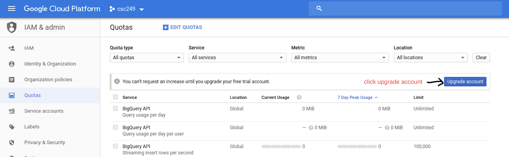
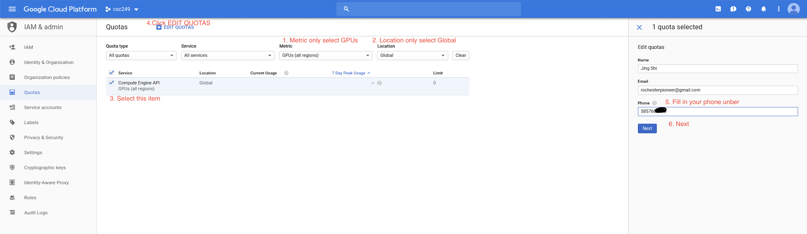
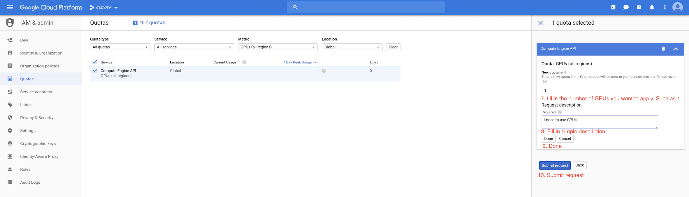
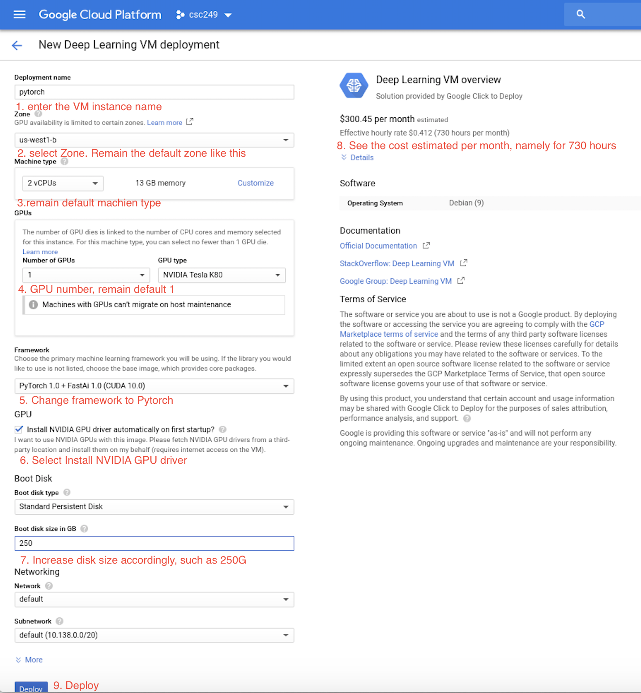
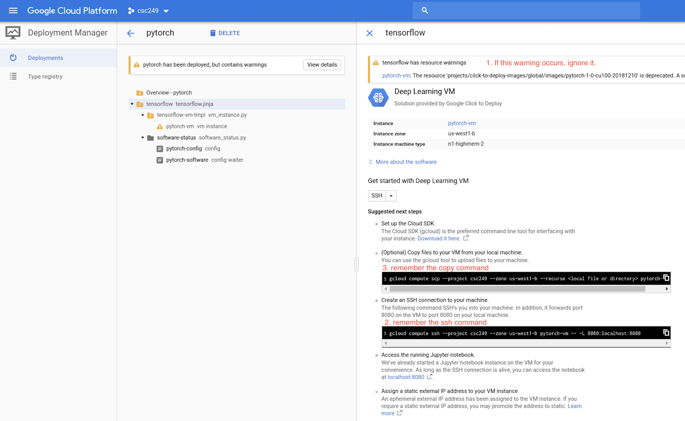

# Configure google cloud pytorch VM

## 1. Create a new google cloud project 

Create a new cloud project [here](https://console.cloud.google.com/cloud-resource-manager).

- You need a google account to log in.
- When entering the above link, click `+CREATE PROJECT`, you will go to a new page.
- Accept the term of service.
- Enter the project name, such as 'csc577'.
- Click `CREATE`.
- There is a \$300 promotion at the top of the page, click `ACTIVATE`
- Filling out the payment page, which requires your payment method. But no worry, you have free \$300 promotion and wont't be charged. Finally, click `START MY FREE TRIAL`

## 2. Start deep learning VM

### (a). Require GPUs

Since we are using GPUs, we need to acquire the number of GPUs in [Quotas](https://console.cloud.google.com/quotas?_ga=2.186016044.-444096342.1547227127). The specific steps are as follows:

- Upgrade your account as 

  **After updating your account, your billing account will be charged automatically since the \$300 promotion runs out. So remember to disable the billing account at [here](https://support.google.com/cloud/answer/6293499#enable-billing) when the remaining amount is insufficient.**

- Filter the metric, edit quota and send a GPU request as follows.

  

- Then a conformation email will be sent to your gmail. The request will be approved by email notification within a few hours (2 hours for me).

### (b) Configure deep learning VM 

Having been approved for the GPU request, go to [Deep Learning VM](https://cloud.google.com/deep-learning-vm/docs/pytorch_start_instance) and follow the instruction of subsection *With one or more GPUs* in section *Creating a PyTorch Deep Learning VM instance from the Cloud Marketplace*. A configuration  example is as follow. 

- After clicking **Launch on Compute Engine**, you can configure the VM as 

- Once the VM has been deployed, the page will update with instructions for accessing the instance as . **Remember the ssh command to the VM**.

- Next step is to install cloud sdk described in section [Install cloud sdk](#cloudsdk), so that you can connect to theVM instance.

## 3. Install cloud sdk and connect to VM 

- Go to the [sdk quickstart](https://cloud.google.com/sdk/docs/quickstarts) page and select the suitable OS. Follow the instructions when you can successfully finish `gcloud init`.
- Run the ssh command copied from [step 2 (b)](#configVM). The ssh command template is `gcloud compute ssh --project YOUR_PROJECT_NAME --zone YOUR_ZONE_NAME YOUR_VM_NAME -- -L 8080:localhost:8080`
- Now you have done! 

## 4. Manage your VM instance and bill.

- Go [here](https://console.cloud.google.com/compute) to manage your VM instance. If your VM instance is idel, stop it to prevent from charging and start it next time when using.
- Go [here](https://console.cloud.google.com/billing/) to check your bill and balance.

